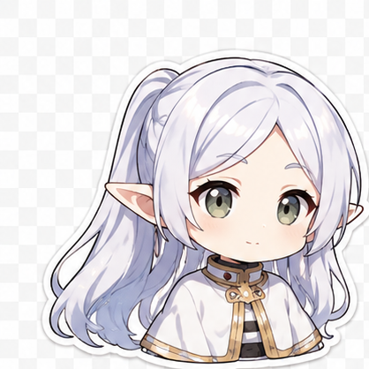
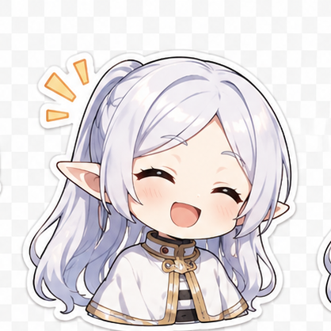
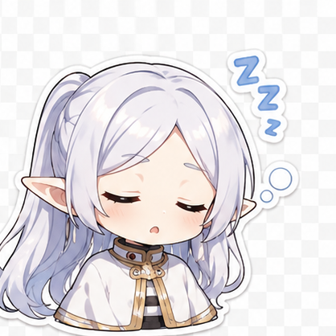
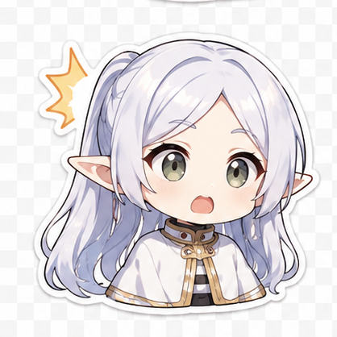
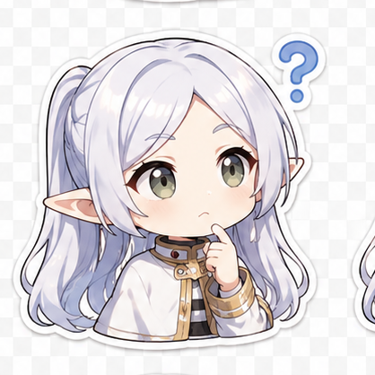
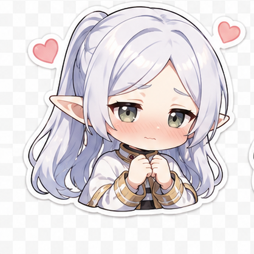
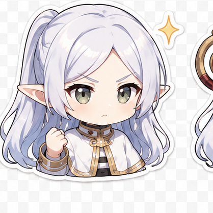

  

<!-- Expression strip from assets/2.png (3×3 split) -->

  
  
  
  
  
  
  
  
  

## Cleveland · `@Jinger-ui`

**Full-stack · RAG · LLM Agents · BERT-era NLP**

Sticker expressions above are cropped from <code>assets/2.png</code> · chibi sprites for section flair

---

<h3 align="center">Profile / Resume</h3>

### About me

I'm a developer who likes turning **papers and prototypes into software you can ship**: retrieval pipelines, agents with tools, and encoder models that behave well in production. I care about clear evaluation for RAG, predictable agent traces, and BERT-family encoders when you need dense vectors, classifiers, or a cheap baseline before scaling up.

---

### Core technical focus

| Area | What I actually work on |
|------|-------------------------|
| **RAG** | Chunking strategies, hybrid / dense retrieval, re-ranking, grounding, hallucination mitigation, retrieval eval harnesses |
| **Agents** | Tool calling, planners & orchestration patterns, retries & guardrails, logging / observability for multi-step flows |
| **BERT & encoders** | Fine-tuning and inference for classification & embeddings, distill / route models, pairing encoders with vector stores |

---

### Full-stack engineering

Comfortable owning features **end-to-end**: API design, persistence, deployment, and a pragmatic front end when the product needs it. Typical stack overlaps:

Exact logos may vary by project—that’s intentional; swap in your dominant stack badges if needed.

---

### Where I’m heading next

Two directions I’d like to go deeper soon:

1. **Federated learning & privacy-preserving ML** — training and updating models with decentralized data without centralizing sensitive payloads  
2. **Embedded / edge development** — smaller deploy targets, efficient inference stacks, and hardware-aware agents outside the comfy cloud default

Ping me if you’re building in either space.

---

### Quick extras

- **Comfort zone:** structuring messy knowledge into retrieval-friendly stores and agent-safe tools  
- **Working style:** small experiments → measurable uplift → refactor for maintainability  

